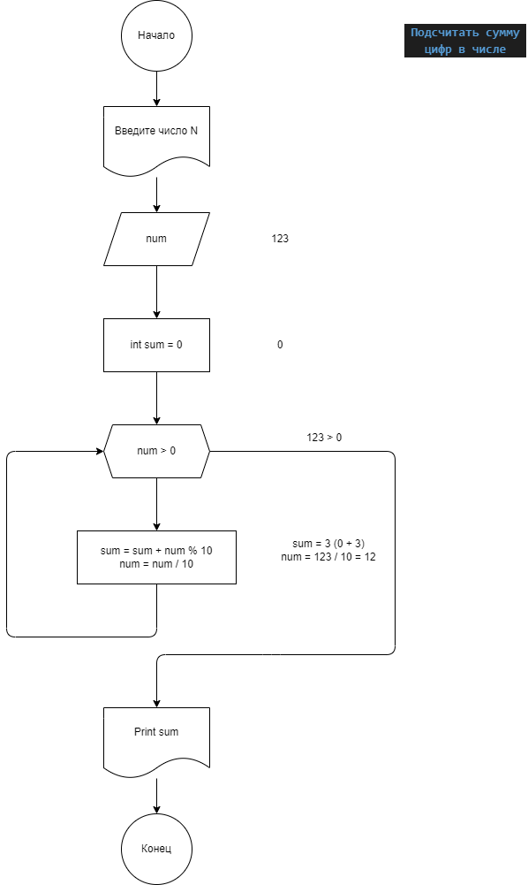

## Independent_Work_1

1. Task_001
#### Удалить вторую цифру трёхзначного числа

[Код](task_001/Program.cs)

2. Task_002
#### По двум заданным числам проверять является ли одно квадратом другого

[Код](task_002/Program.cs)

3. Task_003

#### Подсчитать сумму цифр в числе

[Код](task_003/Program.cs)

4. Task_004

#### Показать кубы чисел, заканчивающихся на четную цифру

[Код](task_004/Program.cs)

34. Task_034

#### Написать программу замену элементов массива на противоположные

[Код](task_034/Program.cs)

39. Task_039

#### Найти произведение пар чисел в одномерном массиве. Парой считаем первый и последний элемент, второй и предпоследний и т.д.

[Код](task_039/Program.cs)

54. Task_54

#### На умножение матриц

[Код](task_054/Program.cs)

64. Показать треугольник Паскаля.
Прказать его в прямоугольной форме
1
1 1
1 2 1
1 3 3 1
1 4 6 4 1

* Прказать его в равнобедренной форме (хотя бы 20 строк)

(a+b)^2 = 

    1                                    
   1 1                                    
  1 2 1                                    
 1 3 3 1                                    
1 4 6 4 1                                    

** Показать разложение многочлена m-ой степени при помощи треугольника

*** Показать треугольник Паскаля в виде

    *                                    
   * *                                    
  *   *                                    
 * * * *                                    
*       *

НО показывайте "*" только если соответствующий коэф треугольника нечетный 

Хотя бы для 100 строк

[КОД](task_064/Program.cs)

66. Task_066

66. Показать натуральные числа от 1 до N, N задано

[КОД](task_069/Program.cs)