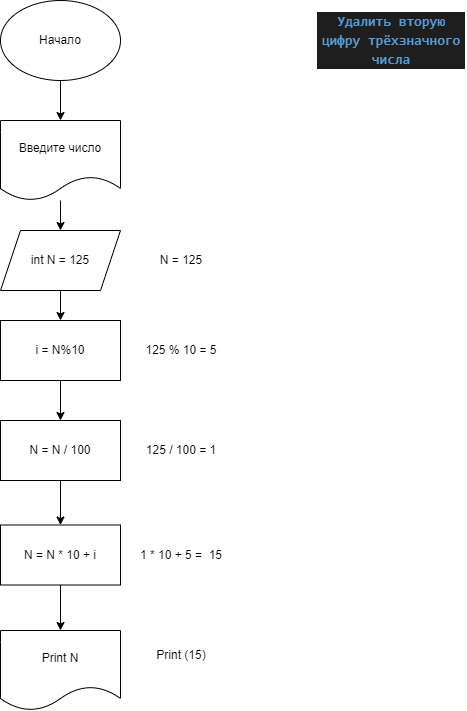
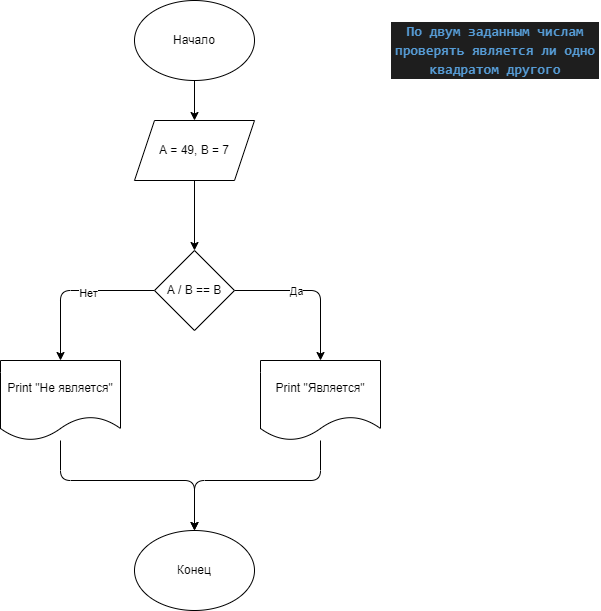

## Independent_Work_1

1. Task_001
#### Удалить вторую цифру трёхзначного числа

[Код](task_001/Program.cs)

2. Task_002
#### По двум заданным числам проверять является ли одно квадратом другого

[Код](task_002/Program.cs)